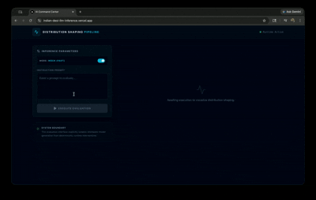

# Frontend Setup

Next.js React application comprising the AI systems control interface.

## 🎬 Live Demo



> Demonstration of raw vs runtime-shaped outputs, showing entropy reduction, KL divergence, and real-time inference pipeline behavior.

## Install
```bash
npm install
```

## Run
```bash
npm run dev
```

**See [TODO.md](TODO.md) for final GIF recording instructions.**

